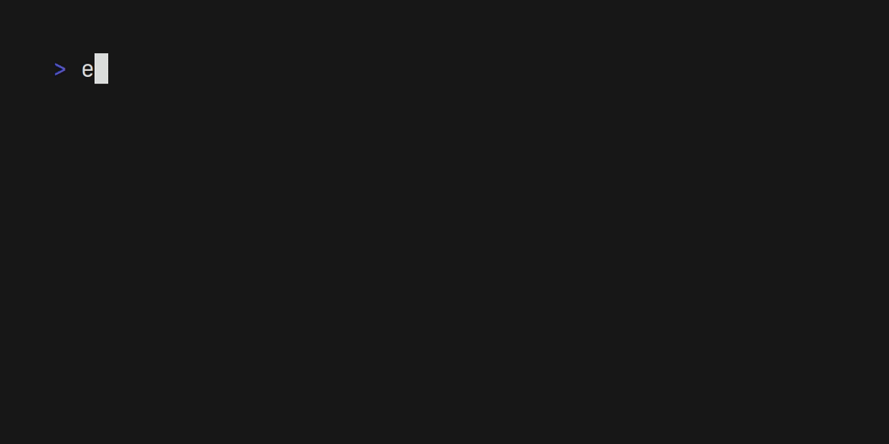


"Of course it is happening inside your head, Harry, but why on earth should that mean that it is not real?" 

-**Dumbledore**


___
## Whoami?

"You are not a drop in the ocean. You are the entire ocean in a drop."
 
 

## Why I made this ?
My personal void to share some thoughts and ideas, sometimes it might get really silly, funny or technical (who knows). Also since sharing is caring, I wanted to explain my thoughts in a simple way that my future me could understand, coz I easily forget things.

> "The difference between school and life? In school, you're taught a lesson and then given a test. In life, you're given a test that teaches you a lesson." - Tom Bodett

## Skills

Below are some of the languages, I used, based on my github projects, also I can freely swtich between languages like:
- TypeScript
- Java
- Ruby
- Bash
- C/C++ 



## Projects

All The projects can be found [Here](https://github.com/AYehia0?tab=repositories), but here is a list of my top projects.

### [Gimme](https://github.com/AYehia0/Gimme)
Gimme is an application that helps users to reach unoffical stores and get their items by tusted users, from the people to the people.
It's built with NodeJS, with lots of integrations and microservices like AWS S3, Firebase FCM, and more.

## [SoundCloud-dl](https://github.com/AYehia0/soundcloud-dl)
A CLI tool to download SoundCloud tracks and playlists, written in Go. 

## [Quran-In-Terminal](https://github.com/AYehia0/quran-go)
Read the holy quran in your terminal, written in Go.

### [HealthLife](https://github.com/AYehia0/healthLife)
HealthLife is a MEAN stack application used to keep track of what you have eaten through out the day. The application was made for an Internship in NTI.

### [ImageToolKit](https://github.com/AYehia0/ImageToolKit)
ImageToolKit is a image processing GUI written in python, for a college course.

