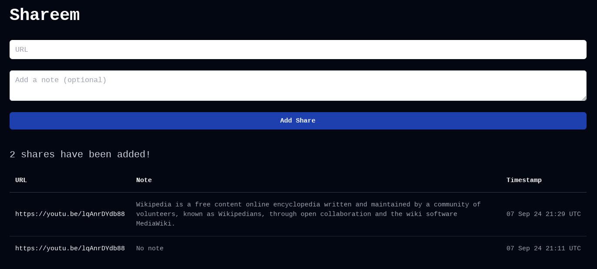

How to setup a production ready server with very minimal requirements/specs with CI/CD pipeline and standard security enabled ?
<!--more-->

# Achievements/todo
Below the requirements for a production ready application:
- [X] Has a domain name
- [X] Application must be running
- [X] Domain must have secure connection through HTTPS with auto-renewed TLS Certificate
- [X] SSH hardened to prevent unauthorized access
- [X] Application must be protected by a firewall
- [X] Load balancer to distribute load across multiple nodes in case one crashed
- [X] Automated deployments: pushing to certain branch triggers deployment with minimal downtime
- [X] Monitoring: know if the service is down
- [X] No infrastructure as code like terraform or bloated solutions like AWS


## Getting started

I am going to be deploying a very simple golang application called [shareem](https://github.com/ayehia0/shareem) made just for demonstration purposes and to show some really cool and powerful deployment and setup tools, alnog side with best practices you should follow when deploying your app.

## VPS Setup
Since we're going very minimal, I am not going with fully-fledged solutions like AWS or Google Cloud, instead I am going with a VPS (Virtual Private Server) with a very limited resources (I chose DigitalOcean as I am already subscribed)



The specs of the machine is a bit overkill for the project but I decided to go with higher RAM for a reason (Spining multiple instances of the application in case one failed or crashed):
- 2 vCPUs
- 4 GB RAM
- 120 GB SSD Storage

The machine is running an Ubuntu LTS (Long Term Support) OS!

## DNS Pointing


I am going to use my existing domain `ayehia0.info` to create a sub domain to be used for accessing the application instead of using the `ip` (Yeah, that's basically DNS), by creating a DNS record to point to the VSP IP address and give it some time to populate to the global DNS registery.

Now we can access our application by visiting: [https://shareem.ayehia0.info](https://shareem.ayehia0.info) (`ofc it's not yet deployed!`)


Check if the DNS record has been probagated by running a nslookup:
```bash
$ nslookup shareem.ayehia0.info

Server:         127.0.0.53
Address:        127.0.0.53#53

Non-authoritative answer:
Name:   shareem.ayehia0.info
Address: 159.223.215.229
```

As you can see `shareem.ayehia0.info` is resolving to the correct address of the machine.

Now we can ssh by: `ssh none@shareem.ayehia0.info`


## VPS Security

### Add non-root user
It's recommended to add a non-root user with limited access as working with root user isn't advised.

```bash
adduser none
```

Adding sudo permission to the created user:

```bash
usermod -aG sudo none
```

Testing the user `none` with sudo permission:

```bash
su - none
sudo ls /
```
### Hardening SSH
My friend Hossam wrote a great blog [here](https://hossamdash.hashnode.dev/securing-and-optimizing-ssh) which shows the best practices for securing and optimizing SSH connections in Unix and Linux Systems. for my case I am not going to follow all of his recommendations but I will prevent SSH Bruteforcing by disabling password authentication in SSH.

Before doing this let's copy the SSH public key for the non-root user `none` I tried using the ssh-copy-id :

```bash
ssh-copy-id -i ~/.ssh/id_rsa.pub none@159.223.215.229
```

but it gave me Permission denied (publickey), so I did it the hard way (manually):

1. SSH into the machine as root: `ssh root@159.223.215.229`
2. Switch to `none` user (non-root): `su - none`
2. Copy your public ssh key to the `none` home directory: `~/.ssh/authorized_keys`


Now it's time to disable the ssh password auth and do some hardening, by editing the ssh config file under `/etc/ssh/sshd_config`
```bash
PasswordAuthentication no
PermitRootLogin no
UsePAM no
```

Then reload the ssh service: `sudo systemctl reload ssh` and try to login again with the root user: `ssh root@159.223.215.229` it should fail!


To add more security SSH you can change the port in which the SSH is running on, but it's kinda overkill.


### Firewall
Let's enable a firewall to our machine, we want to enable only these ports:
- `22` for SSH
- `80` for HTTP
- `443` for HTTPS

I am going to be using the pre-installed utility called `ufw` (Uncomplicated Firewall):
1. Rule to disable all incoming requests: as general mask
```bash
sudo ufw default deny incoming
```
2. Rule to enable all outgoing requests
```bash
sudo ufw default allow outgoing
```
3. Rule to enable incoming requests from SSH (OpenSSH)
```bash
sudo ufw allow OpenSSH
```
4. Enable the rules
```bash
sudo ufw enable
```


Don't forget to enable incoming requests to the SSH port :80 or you won't be able to access the machine lol




This is known issue with ufw and docker as docker configurations overwrite the ip table (ufw configs), so your application running on port 80 will still work!

A workaround is to use this : `127.0.0.1:8080:8080` instead of `8080:8080` in your docker-compose file, but it's not ideal!, the ideal solution is to use a reverse proxy!



## Server setup
There are multiple solutions for running an application on a server, one is to build and run manually but it's not ideal!, and another one is using containers! and that's what we will go for.

- So we need to have docker installed on the machine: achieved by following this [tutorial](https://www.digitalocean.com/community/tutorials/how-to-install-and-use-docker-on-ubuntu-22-04)

- Then we need to clone the repo on the server, add any nesserary secrets: in our case `db/password.txt` is required, and `.env` which contains the email address (used to renew the SSL Certificate)

- Running the server using docker: `docker compose -f docker-compose.prod.yml up`


Make sure to make the package public otherwise you will have to use the Github Personal Token to be able to pull it!


## Deployment flow



The flow is pretty simple, when I, the developer, push changes to my `master` branch on github. A github action is triggered which builds and pushes the image to github registry:

```yml
name: Deploy to github registry
on:
 push:
   branches:
     - 'master'
permissions:
  packages: write
  build-and-push-image:
    runs-on: ubuntu-latest
    steps:
      - name: Checkout repository
        uses: actions/checkout@v3

      - name: Log in to the Container registry
        uses: docker/login-action@v3
        with:
          registry: https://ghcr.io
          username: ${{ github.actor }}  # the current user
          password: ${{ secrets.TOKEN }} # the PAT

      - name: Build and push Docker image
        uses: docker/build-push-action@v6
        with:
          context: . # uses the Dockerfile which is the production one
          push: true
          tags: ghcr.io/ayehia0/shareem:prod
```

The server running watchtower scans the registry and replaces the old image with the new one!

But what about traefik ? it works as load balancer, reverse proxy and auto-renews the SSL certificate! (Pretty cool)

### Flow in detail

Blew are the docker-compose services used in this application, I will only explain the most important ones (watchtower, traefik and the interaction with the application services `shareem`)

#### watchtower
First of all the `watchtower` service:
```yml
  watchtower:
    image: containrrr/watchtower
    command:
      - "--label-enable"
      - "--interval"
      - "30"
      - "--rolling-restart"
    volumes:
      - /var/run/docker.sock:/var/run/docker.sock
```

- `--label-enable` : monitor and update containers that have a `com.centurylinklabs.watchtower.enable` label set to true, in our case the `shareem` container.
- `--interval`: poll interval (in seconds). This value controls how frequently watchtower will poll for new images, in our case it's `30s`
- `--rolling-restart`: restart one image at time instead of stopping and starting all at once. Useful in conjunction with lifecycle hooks to implement zero-downtime deploy. This allows us to minimize the down-time as the user will (maybe) hit one of the instances.

#### traefik
Secondly, `traefik` is a reverse proxy and load balancer that helps route traffic to our application containers. In this setup, Traefik dynamically discovers Docker containers that have been started with appropriate labels and routes traffic based on domain names and ports. This configuration also includes automatic HTTPS support using Let's Encrypt and TLS challenge for domain validation.

Let's break down the key configurations:
```yml
  reverse-proxy:
    image: traefik:v3.1
    environment:
        EMAIL: ${EMAIL}
    command: 
      - "--providers.docker"
      - "--providers.docker.exposedbydefault=false"
      - "--entryPoints.websecure.address=:443"
      - "--certificatesresolvers.myresolver.acme.tlschallenge=true"
      - "--certificatesresolvers.myresolver.acme.email=${EMAIL}"
      - "--certificatesresolvers.myresolver.acme.storage=/letsencrypt/acme.json"
      - "--entrypoints.web.address=:80"
      - "--entrypoints.web.http.redirections.entrypoint.to=websecure"
      - "--entrypoints.web.http.redirections.entrypoint.scheme=https"
    ports:
      - "80:80"
      - "443:443"
    volumes:
      - letsencrypt:/letsencrypt
      - /var/run/docker.sock:/var/run/docker.sock
```

Key configurations explained:

- `--providers.docker`: Traefik is set up to use Docker as a provider. This means that Traefik will discover the Docker containers running on the host and route traffic to them based on their labels.

- `--providers.docker.exposedbydefault=false`: By default, Traefik does not expose Docker containers unless explicitly specified using labels on each container. This provides better security by ensuring that only labeled services are available externally.
 
- `--entryPoints.websecure.address=:443`: This defines an entry point for secure HTTPS traffic on port 443. This is where all HTTPS traffic will be routed.
 
- `--certificatesresolvers.myresolver.acme.tlschallenge=true`: Traefik is configured to use the ACME protocol with TLS challenge to automatically generate and renew SSL certificates via Let's Encrypt.
 
- `--certificatesresolvers.myresolver.acme.email=${EMAIL}`: The email parameter required by Let's Encrypt is passed from the environment variable ${EMAIL}. This ensures that the email address is not hardcoded, making the Docker Compose file flexible and secure.
 
- `--certificatesresolvers.myresolver.acme.storage=/letsencrypt/acme.json`: This defines where Traefik will store the SSL certificates generated by Let's Encrypt. In this case, they are stored in the /letsencrypt/acme.json file, which is persisted across container restarts using the letsencrypt volume.
 
- `--entrypoints.web.address=:80`: This defines an entry point for HTTP traffic on port 80. HTTP traffic will be automatically redirected to HTTPS.
 
- `--entrypoints.web.http.redirections.entrypoint.to=websecure`: This tells Traefik to automatically redirect all incoming HTTP requests on port 80 to HTTPS (port 443).
 
- `--entrypoints.web.http.redirections.entrypoint.scheme=https`: This ensures the redirection from HTTP to HTTPS uses the correct scheme.

The following ports are exposed in the configuration:

ports:
  - "80:80"
  - "443:443"

This means that Traefik will listen for traffic on both ports, handling HTTP and HTTPS traffic, with HTTP being redirected to HTTPS.

#### application
In order to make the application fully work with watchtower and traefik, we need to have these labels:
```yml
  shareem:
    image: ghcr.io/ayehia0/shareem:prod
    labels:
      - "traefik.enable=true"
      - "traefik.http.routers.shareem.rule=Host(`shareem.ayehia0.info`)"
      - "traefik.http.routers.shareem.entrypoints=websecure"
      - "traefik.http.routers.shareem.tls.certresolver=myresolver"
      - "com.centurylinklabs.watchtower.enable=true"
```
- `traefik.enable=true`:
This label tells Traefik to manage this container. If this label is set to true, Traefik will consider this container for routing traffic. If set to false, Traefik will ignore it.

- `traefik.http.routers.shareem.rule=Host(shareem.ayehia0.info)"`:
This label defines the routing rule for the shareem service. It specifies that Traefik should route requests to this container if the request's Host header matches shareem.ayehia0.info. This allows Traefik to direct traffic to the correct service based on the domain name.

- `traefik.http.routers.shareem.entrypoints=websecure`:
This label specifies that the shareem service should use the websecure entry point, which is configured to handle HTTPS traffic on port 443. This means that Traefik will route HTTPS traffic to this service.

- `traefik.http.routers.shareem.tls.certresolver=myresolver`:
This label instructs Traefik to use the myresolver certificate resolver to automatically obtain and renew TLS certificates for the shareem service. The myresolver is configured in the Traefik settings to use Let's Encrypt for issuing certificates.

- `com.centurylinklabs.watchtower.enable=true`:
This label enables Watchtower's monitoring and update features for this container. Watchtower will check for updates to the shareem image and perform rolling restarts if a new version is available, ensuring that the container runs the latest version without downtime.

Here is the full `docker-compose` file:
```yml
services:
  watchtower:
    image: containrrr/watchtower
    command:
      - "--label-enable"
      - "--interval"
      - "30"
      - "--rolling-restart"
    volumes:
      - /var/run/docker.sock:/var/run/docker.sock
  reverse-proxy:
    image: traefik:v3.1
    environment:
        EMAIL: ${EMAIL}
    command: 
      - "--providers.docker"
      - "--providers.docker.exposedbydefault=false"
      - "--entryPoints.websecure.address=:443"
      - "--certificatesresolvers.myresolver.acme.tlschallenge=true"
      - "--certificatesresolvers.myresolver.acme.email=${EMAIL}"
      - "--certificatesresolvers.myresolver.acme.storage=/letsencrypt/acme.json"
      - "--entrypoints.web.address=:80"
      - "--entrypoints.web.http.redirections.entrypoint.to=websecure"
      - "--entrypoints.web.http.redirections.entrypoint.scheme=https"
    ports:
      - "80:80"
      - "443:443"
    volumes:
      - letsencrypt:/letsencrypt
      - /var/run/docker.sock:/var/run/docker.sock
  shareem:
    image: ghcr.io/ayehia0/shareem:prod
    labels:
      - "traefik.enable=true"
      - "traefik.http.routers.shareem.rule=Host(`shareem.ayehia0.info`)"
      - "traefik.http.routers.shareem.entrypoints=websecure"
      - "traefik.http.routers.shareem.tls.certresolver=myresolver"
      - "com.centurylinklabs.watchtower.enable=true"
    secrets:
      - db-password
    environment:
      - POSTGRES_HOST=db
      - POSTGRES_PASSWORD_FILE=/run/secrets/db-password
      - POSTGRES_USER=postgres
      - POSTGRES_DB=shares
      - POSTGRES_PORT=5432
      - POSTGRES_SSLMODE=disable
    deploy:
      mode: replicated
      replicas: 3
    restart: always
    depends_on:
      db:
        condition: service_healthy
  db:
    image: postgres
    restart: always
    user: postgres
    secrets:
      - db-password
    volumes:
      - db-data:/var/lib/postgresql/data
    environment:
      - POSTGRES_DB=shares
      - POSTGRES_PASSWORD_FILE=/run/secrets/db-password
    expose:
      - 5432
    healthcheck:
      test: [ "CMD", "pg_isready" ]
      interval: 10s
      timeout: 5s
      retries: 5
volumes:
  db-data:
  letsencrypt:
secrets:
  db-password:
    file: db/password.txt
```

## Final touches
We're almost there, one little piece is missing! remember when we required to have monitoring ? since we just need to get notified when the service is down we can use a service called [UptimeRobot](https://uptimerobot.com/) for that!


Since you reached this point, here is a fun fact for you: Did you know that if you hold your breath for long time you can sleep for ever.
