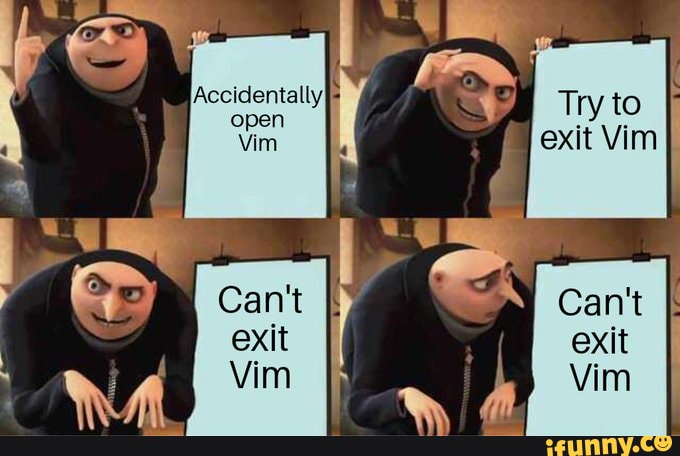
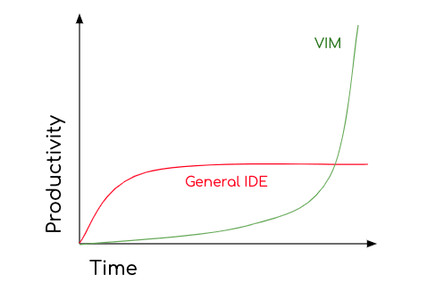
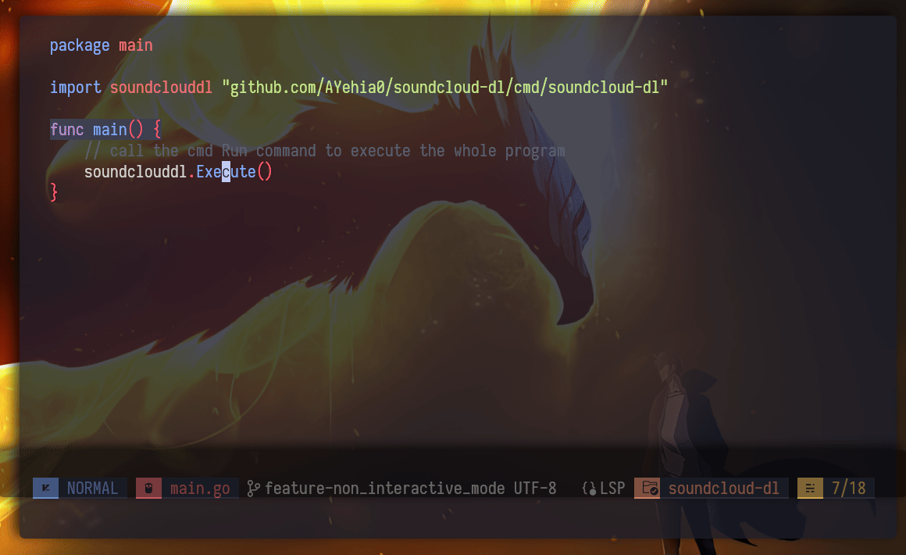
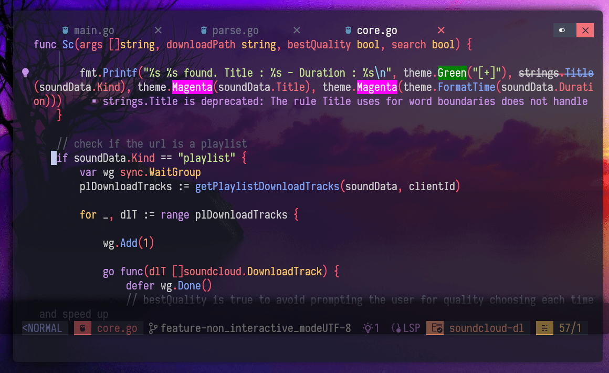
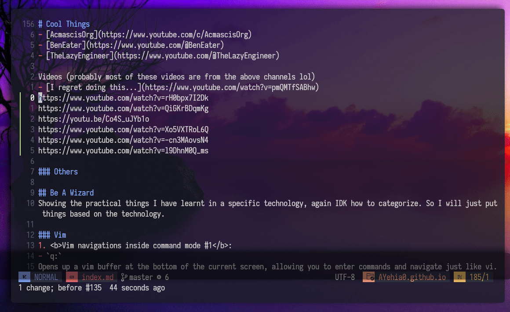
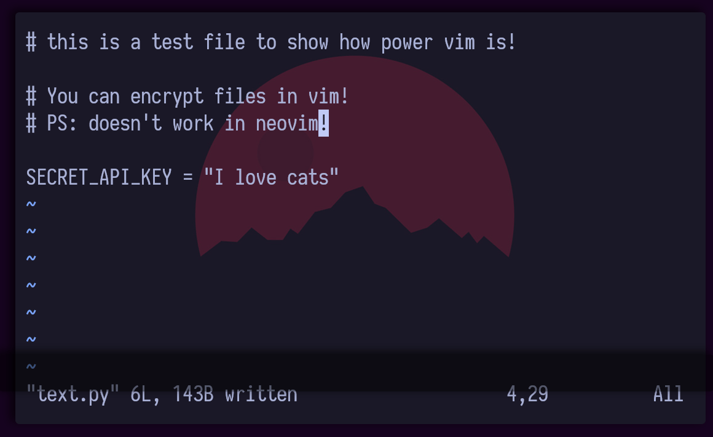
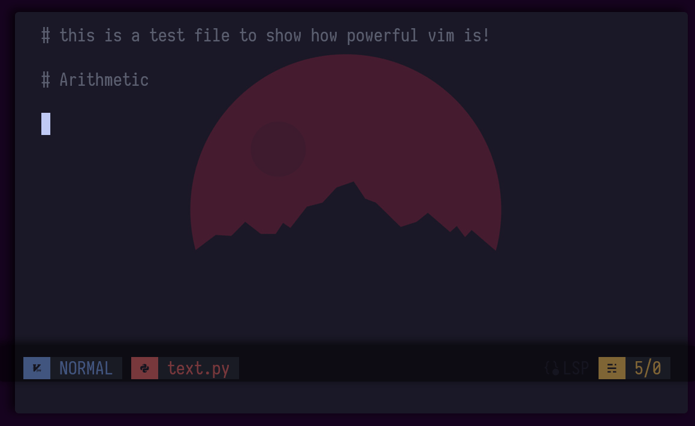

# But can your text editor do this ? | Avearge Vim User Experience


Yes, you read it right!, I use vim as my daily driver coding kit!, some people say you can't and others just doubt that saying; you can't do proper coding on real production projects unless you have a bloated IDE like VS Studio or intellij, in this blog I will prove the opposite!

<!--more-->

## Why Vim ?
It started 6 years ago, when I doing my BCs degree in Computer Engineering, I had a really old ass laptop with 4gb RAM and 2 Cores old AMD CPU with HDD!, it was damn too slow, I could just do one thing a time (VS code or Browser) and I was also using linux (the n00b way). The struggle was real till I was editing the sudoers file `/etc/sudoers` and I was so frustrated that I couldn't exit vim lol, and I have been using vim since then!, just kidding I had to restart my laptop lol.

<br>
<p align="center">
    
</p>

Anyways, I found vim really lightweight and customizable which suited me a lot!. 2 years later I switched to vim as my main editor and learned a lot during that journey!

So, why vim ?
- Lightweight and highly customizable
- Efficient keyboard-driven interface which I just fall in love coz I just hate switching back and forth to my mouse!
- Wide range of plugins and extensions available
- Works well on remote servers or low-resource environments, just ssh into remote servers and do magic using vim

There are way many features vim has that will make you a faster engineer (I will discuss later), but first should you use vim ?

## Should you use vim ?
Is it worth learning vim and replace your editors/IDEs ?

<br>
<p align="center">
    
</p>

Vim is hard but it's worth the effort to learn, investing in the tools and workflows have a serious payoff over time! and will make you more productive, but here is the catch!

### Don't use vim if ...
#### You think vim is an IDE

It depends on how you define an IDE, if you think an IDE is some program with that mostly edit text with some utilities then I guess you're excused!, sadly that's not how IDEs work at all! IDEs are bloated with many features like debuggers and other things but they aren't bloated for nothing, they do lots of things which require lots of RAM and resources!, but if what you need is a tool to edit, navigate and search text then vim is the way to go.

Vim can be customized with some plugins to provide the basic programming needs!

#### Have a work and you have to do it now

Don't get me wrong on this, what I mean is that if you're just decided to use vim and your boss asked you to do something, don't use vim for it as it will make you slower!. Vim takes some time to learn, may be weeks! If you are serious about learning Vim, do it on the side, progressively, without taking any of the shortcuts you would be tempted to take if you had to learn it on the spot.

If you are in a hurry, use a familiar editor/IDE.

#### You can't afford the time and effort to learn it

Vim is a very powerful text editor that exposes an incredible breadth and depth of functionalities. Learning everything would take a lifetime and learning what you need right now will take months. If you lack the curiosity and the drive required to go past those months, then you should keep using your current text editor.

In general: if you are used to `$FOO` and consider switching to `$BAR`, learn `$BAR` before actually switching to it.

#### The job can be done in a better way

Choose the right tool for the job, specialized tools are very often better alternatives to Vim. Even pen and paper (or marker on whiteboard) can be better for many uses.

### Who is vim for ? who isn't ?
Vim is good for:
- Incredible fast movements
- Highly customizable
- No distractions
- Shell access
- Huge community
- How to exit vim memes

Not good for:
- It's not an IDE
- Those who don't have time to learn it

Will using vim make you a better software engineer ? Probably not, but will make you more productive and if productivity makes you better engineer then vim will!
Also vim will make you know what happens under the hood when you press that green button! as it will require you to setup everything and connect things together, so a better developer yes!. `MASTER YOUR TOOLS`



## Can your IDE do this ?
### Speed boi
Vim is fast!, I have been using vim for more than 3 years that I have developed a seamlessly workflow, I want to search something boom (fuzzy finder), want to create and edit files eazy!!, want to write code (LSP and Treesitter) and some other customizations!

<video src="vim_navigation.webm" autoplay loop></video>

### Marks
Marks is one feature I really like about vim, it allows quickly jumping from one point in file to another point in the same file or other files.


- `me` to mark lines with identifier `e`
- `'e` to jump to line identified by `e`
- `mA` to mark line with identifier `A` but globally


<br>
<p align="center">
    
</p>

### Folding and unfolding text
Folding text is a nice feature in vim that makes your text more readable and lets you foucs on other parts.


- `zf` to fold lines
- `zo` to open folded lines
- `zO` to open all folded lines
- `zc` to close folded lines
- `zC` to close all folded lines



- `za` to toggle close/open
- `zA` to toggle all
- `zm` to cycle folding, `zM` to fold all in the file
- `zr` to cycle unfolding, `zR` to unfold all in the file


<br>
<p align="center">
    
</p>

### Macros
Vim macros are a very powerful feature to allow recording and replaying sequences of commands. This feature is particularly handy for tasks like refactoring code, formatting text, or performing repetitive edits across multiple files.

Here's a real example that shows how powerful this is; when writing a blog or markdown file, sometimes I need to paste some youtube links and I need them to be shown as bullet points and I also want to have the video title, doing this by hand would take some time, so let's automate it.


- `qa` to record a macro with in `a`
- `0y$` copy the current line into register 0
- Execute some command
- `j` to move to the next line
- `q` to end the macro
- `5@a` to execute the macro 5 times


I am using `yt-dlp` to get the title of the video.

```vim
:execute '.!yt-dlp --get-title "' . @0 . '" | tr -d "\n" | xargs -I {} echo "- [{}](' . @0 . ')"'
```

- `@0` the value stored in the register 0
- `:execute` like eval in some languages
- `.!` the `.` to replace the output with the current line, `!` to exeucte shell command

<br>
<p align="center">
    
</p>


### Bonus
#### norm
You can perform commands in normal mode too!

<br>
<p align="center">
    
</p>

#### ! command
You can use the `!` to perform external commands!

<br>
<p align="center">
    
</p>

#### Encryption!
You can encrypt files in vim, (doesn't work on neovim).

<br>
<p align="center">
    
</p>

#### Spell Checking
- Set the spell lang : `set spell! spelllang=en_us`
- To get suggestions : `z=`

### Arithematics
You can perform some math operations like increament and decreament

<br>
<p align="center">
    
</p>

