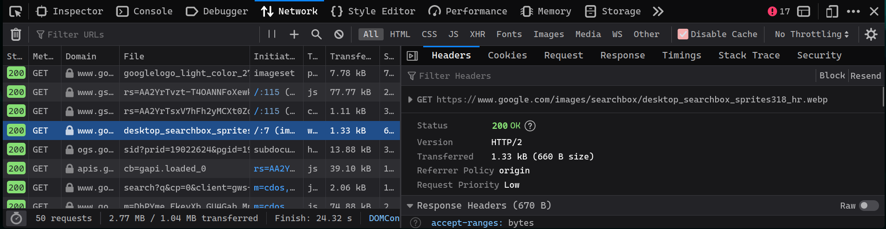
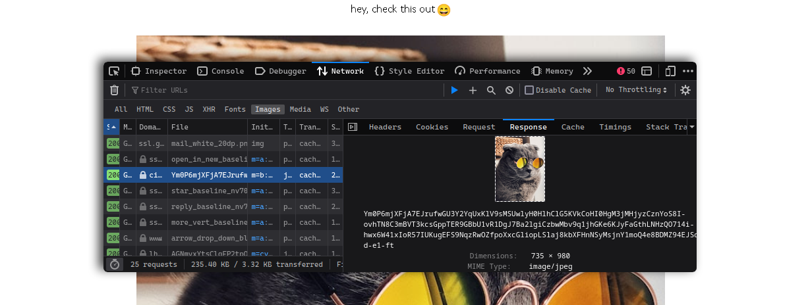
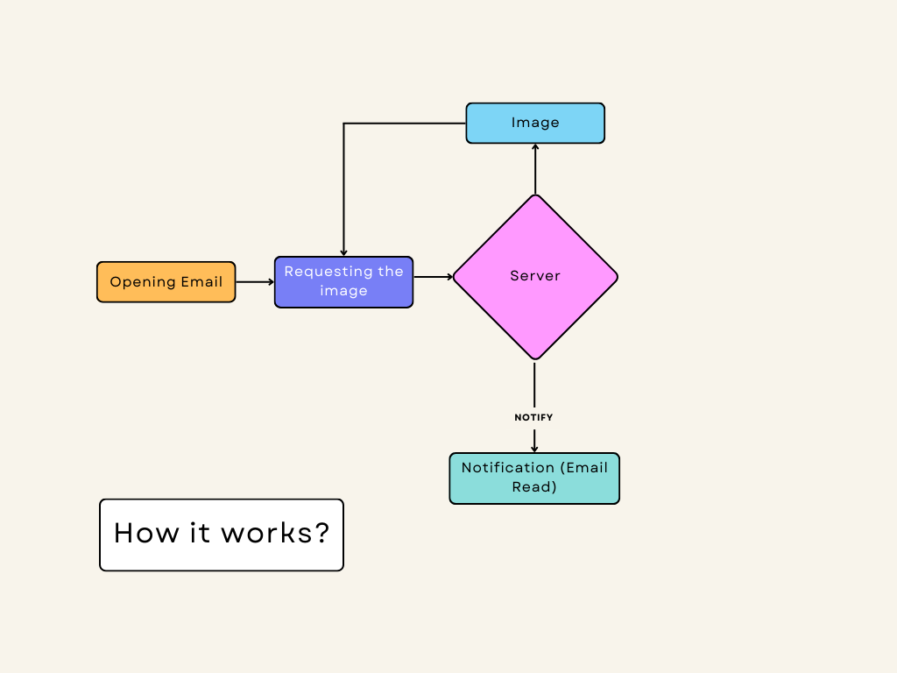

# How email tracking works ?

Have you ever wondered how could someone knows if you read their email or not ?
<!--more-->

## How it works ?
When you click a link some where over the internet, a request is sent to some server where it's being processed. That's exactly what happens here.

That's if you clicked a link, but I am still tracked even though I didn't click any links!

Imagine this, when you load a website client requests some data from the server and automatically makes some requests even though you just did one single GET request (initial request).

 

    

When you open up some email with a embedded image, a request is made through some proxy.

 

    

Since we don't have control over the image(link), we can create our server to process it and notify read to us.
And there is a trick to hide that image by sending [1X1 pixel image](https://en.wikipedia.org/wiki/File:1x1.png).

 

    

## Implementation

I am going to build the server in `nodejs` for simplicity.

### Requirements
- I am using the `http` package to create a server, I could have used `express` but it's overkill for this example.
- `dotenv` to save environment secrets.
- `twilio` for api, could have used the vanila `https` package to send the request.



And finally when the email is read!

 

    

