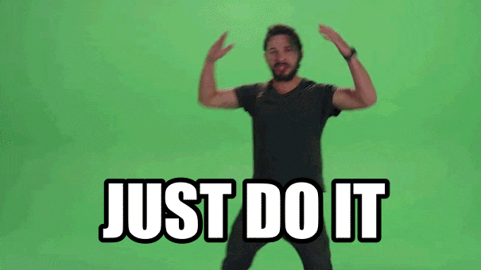

# Wires #1: Getting Started - Requirements and Thoughts

Let's create an insightful, fun and outstanding project. On this long journey of creating such a thing, I will share ups and downs, thoughts and progress.
<!--more-->

## But why ? aka Motivation
The answer to that is another question "Coz why not ?", since learning is a an endless journey and I am somewhere on that line, I believe that making projects is the best way to learn.

 

    

I am interested in creating things from scratch, so I will do my best during this project to make sure that I am not using things that I don't know about. This project is going to be my take on building and visualizing a scalable system starting from just an idea to a final product. I will apply some concepts to make it clean, scalable, maintainable, and easy to use by applying various concepts (I want to learn):
- Visualization
- Multi-Processing
- Containerization
- Using multiple services.

## Getting Started?
So, what now ?, when thinking about creating something, first we need to brainstorm to come up with solutions. Below I have gathered all the things I want to target by the end of this project.


<b>Always keep that in mind that the purpose of this project is to learn</b>




1. Web Application: to make it easy to access.
2. Real-time: we want it to be, as close as how real projects work. Something happens now!
3. Solves a problem: There must be a problem first, so that we can come up with a solution (Thanks Sherlock!).
4. Documented: Not only I will write blogs, I am going to write documentations too (<b>But what are the documentations types ?</b>)
5. Multiple langs: Since I have decent knowledge with Go and I am learning C# now, so diversity is a thing!
6. Public: I meant you don't need to install some stuff to try. Solved #1 + Production application (yeah it works on my machine)

## The Project!
Isn't it obvious?, we're going to build <b>Amazon</b> at home, Just kidding mom!.
We'll create `Realtime Delivery System`, a visualization of how packages are delivered in some imaginary world ofc.
The idea is simple, let's create a system that:
- Tracks the packages in realtime.
- Calculates the optimal route for delivering all packages in a single shot.



## Detailed Overview
I like to call it <b>"High Level Requirements"</b>, in order to gather these requirements there are some steps we need to follow:-
1. <b>Identify Stakeholders</b>: Stakeholders can include end-users, managers, executives, and anyone who will be affected by or have an impact on the project.
In our case, end users are those who will use the application, no managers or executives.
2. <b>Conduct Stakeholder Interviews</b>: We need to ask stakeholders (end-users: <b>us</b>) about their needs, expectations and concerns.
* Normal User
  - I need the application to perform well, look nice and be easy to use (oh what else norm!).
  - The application should allow me to view the delivery route of my orders in realtime, with estimation of arival time.
  - I can cancel any order at any time (unrealistic btw) before the package is delivered.

* Admin User
  - I can view all the orders (traffic) in a region, in realtime.
  - I can cancel an order (reschedule).

* Driver User
  - I should always take the optimal route to deliver all the packages in the shortest time possible.
  - I should get another route if the first optimal one has some conflicts (Traffic Jam, or whatever!).
3. <b>Define Project Scope</b>: Identify what the software is expected to achieve and what features and functionalities are in and out of scope.
Achievement list:
- Visualization of the traffic for all the user depending on the user's role: `Normal, Admin`.
- The drivers' requirements are taken as application process, which mean they will be merged in the actual process.
- Users can cancel orders, and the system should re-calculate the best route in realtime.
- The system should be access by anyone (The Users), in a way that the doesn't require them to install additional software.
Out of scope:
- Reschedule orders.
4. Create Use Case: Develop use cases to understand how different users will interact with the system.




I accidentally made it complex lol, well let's just take a step backwards and make a very simple wireframe design.


That's the simplest form of design I could come up with:



Notes: 
- The settings are chooses by the `end-user`, settings make changes to the map.
- There can be many intersections between routes, which mean many packages are being processed.
- Choosing View as `admin` will show more information about all the drivers and packages.
- When the visualize button is pressed map location dynamically changes in realtime, in infinite loop (respawning new users!).

A general more abstract design:



## Questions
- How to create system design for that ?
- How to choose the system components that suits the our needs ?
- Visualization Engine, huh ?
- How to measure the load on the system ?

